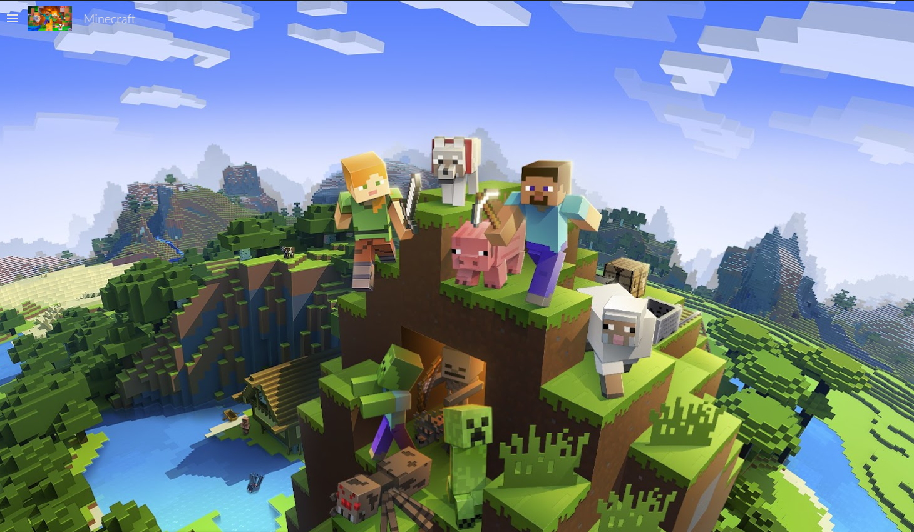

# 🧱 Proyecto Aula: API De Minecraft

> *Proyecto web interativo sobre mods, mobs, biomas, e.t.c de Minecraft, consumiendo una API pública.*

---

## 📝 Descripción

Este es un proyecto desarrollado como parte del primer trabajo práctico del curso. La temática elegida fue **Minecraft**, enfocándose en explorar **mods**, **mobs**, **biomas**, **items**, **biomas** y **mundos** a través de una interfaz web moderna e intuitiva.

La aplicación consume datos desde una **API pública** y los muestra de forma dinámica, organizada en categorías y con diseño responsive para ofrecer una experiencia óptima en cualquier dispositivo.

---

## 🖼️ Maquetación

- Pàgina principal:



- [Haga click aquì para ver la maquetaciòn funcional](https://sites.google.com/view/api-de-minecraft/p%C3%A1gina-principal)
---

---

## 🛠️ Tecnologías Utilizadas

- **HTML5**
- **CSS3 / SASS (Opcional)**
- **JavaScript (Vanilla)**
- **Bootstrap o Tailwind CSS (Si aplica)**
- **API Pública** *(Ej: Forge, Fabric, o API propia mockeada)*

---

## 🔧 Funcionalidades Principales

- ✅ Carga dinámica de información desde una API.
- ✅ Navegación por secciones: Home, Mods, Mobs, Biomas.
- ✅ Filtros interactivos por categoría.
- ✅ Diseño responsivo para dispositivos móviles y escritorio.
- ✅ Tarjetas informativas con imágenes y descripciones.

---

## 📁 Estructura del Proyecto
```
proyecto-minecraft/
│
├── index.html
├── css/
│ └── styles.css
├── js/
│ ├── main.js
│ └── api.js
├── assets/
│ └── images/
└── README.md
```

---

## 🚀 Cómo Ejecutar el Proyecto

1. Clona el repositorio:

   ```bash
   git clone https://github.com/JuanGualdronGallo1203/API-Minecraft

   cd proyecto-minecraft

   # Por ejemplo con Live Server (VSCode)
    npm install -g live-server
    live-server


## 📬 Contacto

- **Nombre**: Juan Sebastian Gualdron Gallo
- **Correo Electrónico**: juangualdron13@gmail.com
- **GitHub**: [Github/Juan Gualdron](https://github.com/JuanGualdronGallo1203) 
